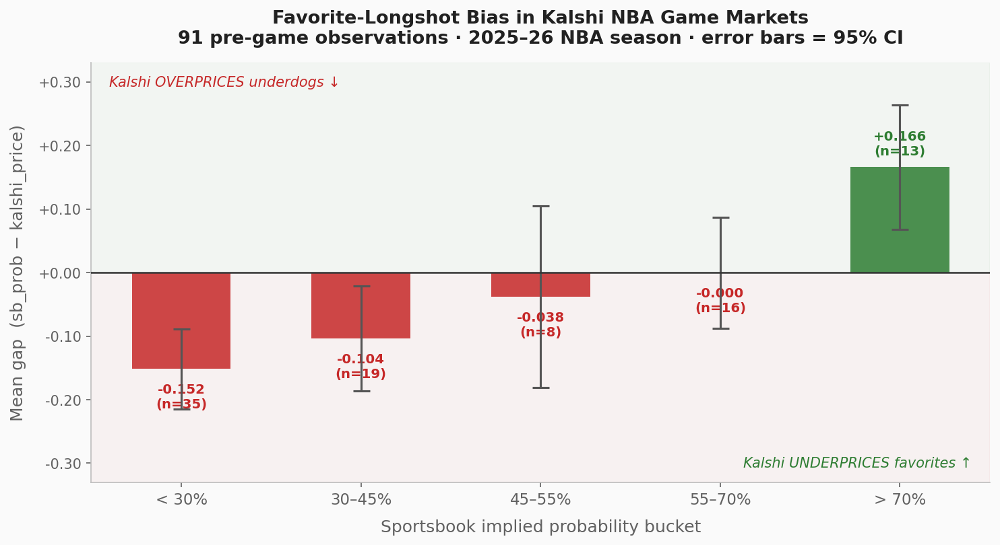
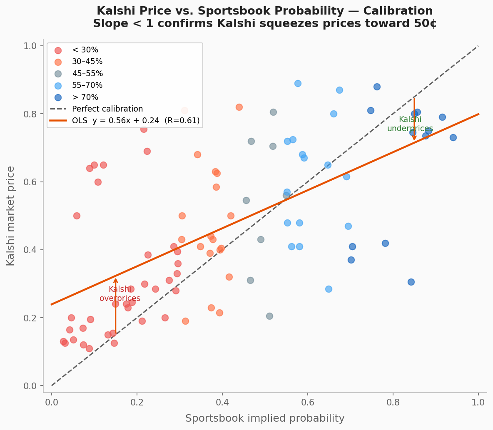
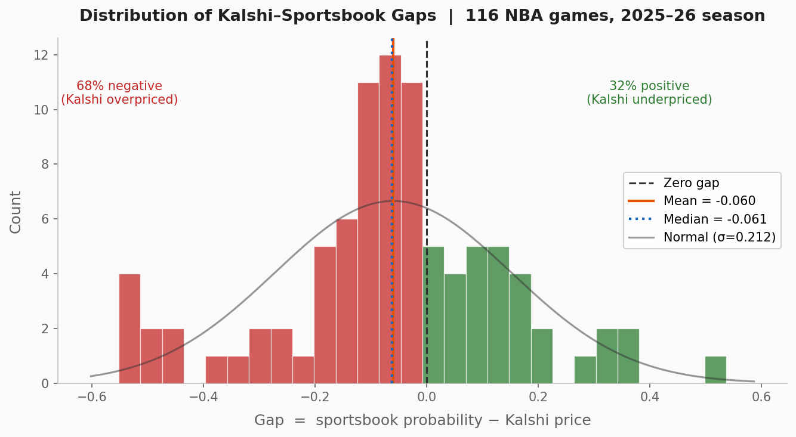
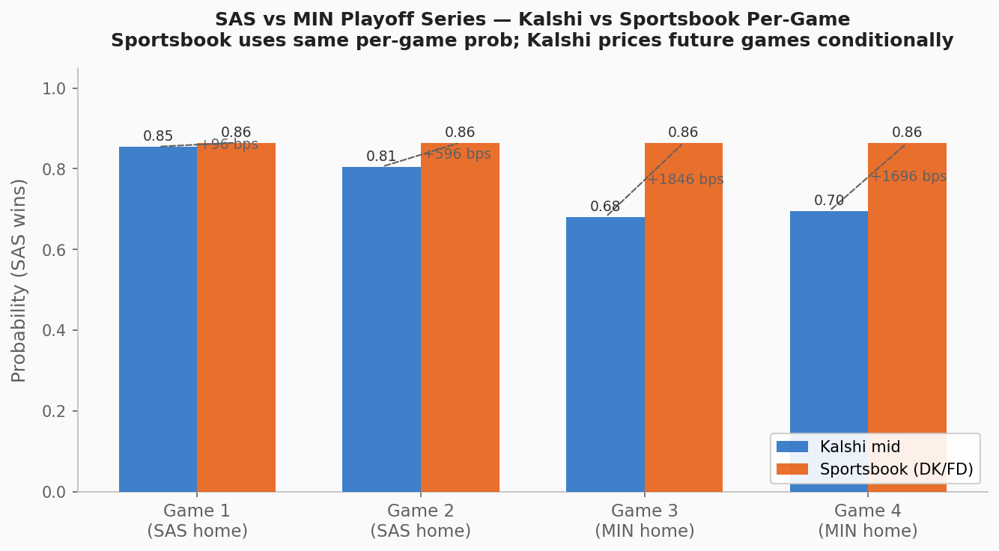
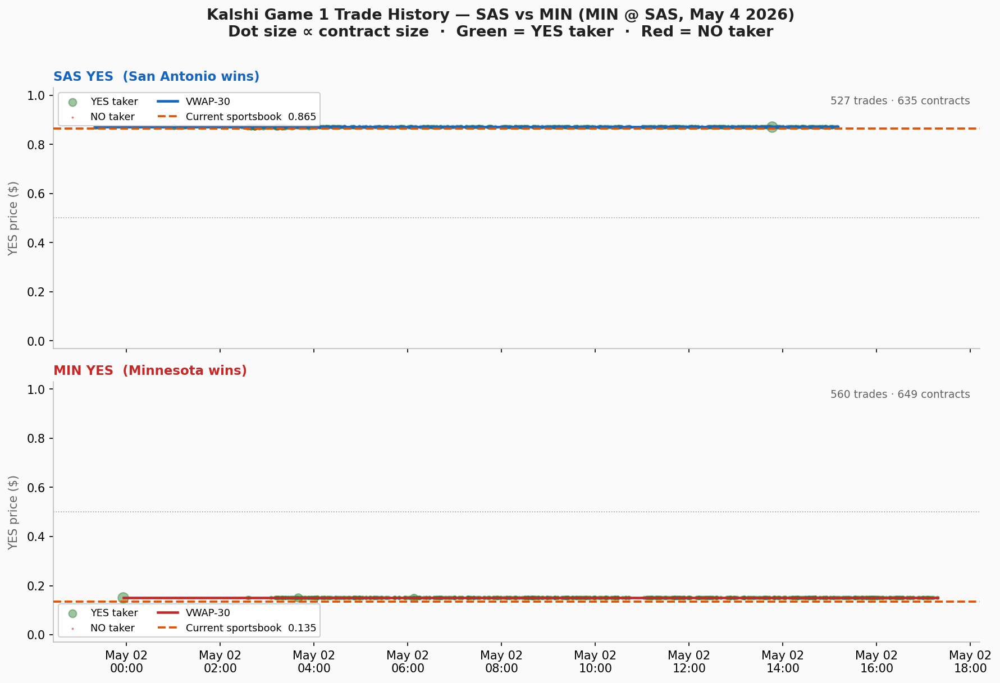
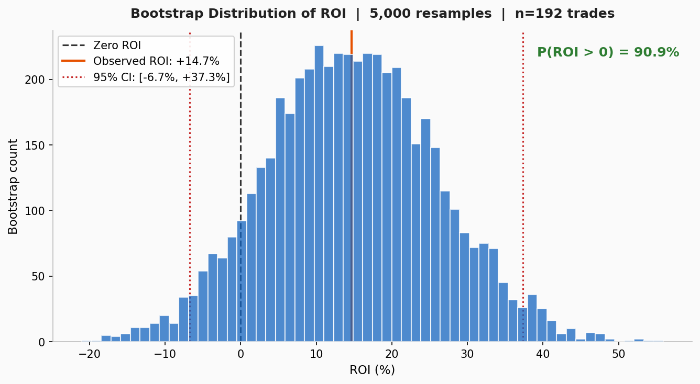
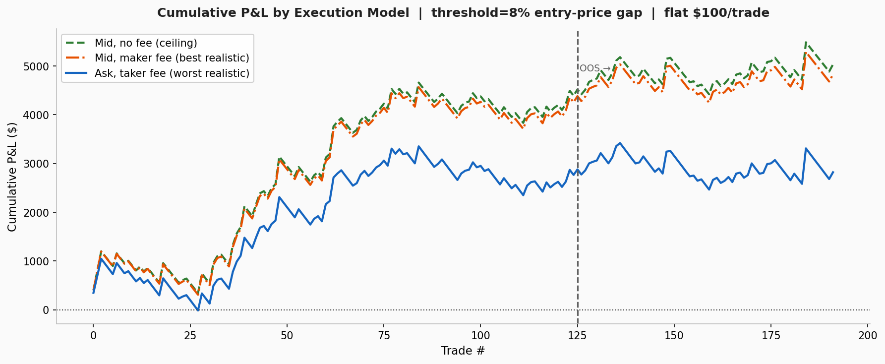

# Kalshi NBA Game Markets — Writeup

I spent the take-home on one question: when sportsbooks and Kalshi disagree about who'll win an NBA game, who's right?

The setup is straightforward. Kalshi runs binary markets called `KXNBAGAME` where you buy YES on a team to win a game. Contracts pay $1 if they win, $0 if they don't. The price in cents is basically the market's view of the probability. So a YES market at 65¢ means the market thinks that team wins about 65% of the time.

For a reference point I used DraftKings and FanDuel moneylines, pulled from The-Odds-API. After stripping out the bookmaker's cut (the "vig"), you get an implied probability you can compare directly to the Kalshi price.

The gap I cared about was:

```
gap = sportsbook probability - Kalshi price
```

Positive gap means Kalshi is underpricing a team. Negative means Kalshi is overpricing.

I pulled all 1,662 finalized `KXNBAGAME` markets for the 2025-26 season, joined them to historical sportsbook odds at T-2h before tipoff, and after filtering out games with bad data I had 363 clean pre-game observations to work with.

---

## What I Found

### 1. Kalshi consistently overpays for underdogs

This was the clearest signal in the data. If I bucket games by what the sportsbook thinks the team's chances are:

| Sportsbook says... | N | Average gap | Kalshi too high? |
|---|---|---|---|
| Big underdog (<30%) | 35 | −15¢ | 89% of the time |
| Light dog (30-45%) | 19 | −10¢ | 79% |
| Coin flip (45-55%) | 8 | −4¢ | 63% |
| Light favorite (55-70%) | 16 | 0¢ | 56% |
| Big favorite (>70%) | 13 | +17¢ | only 15% |

When the sportsbook thinks a team has a 20% chance, Kalshi tends to price it around 35¢. When the sportsbook says 85%, Kalshi sits around 68¢. The pattern moves the same direction across every bucket.

This is my "favorite-longshot bias." It's a well-known thing in horse racing and sports betting. People overpay for long shots because the payoff feels exciting, and underpay for favorites because the payoff feels boring. Looks like the same thing happens on Kalshi.



### 2. Kalshi squeezes prices toward 50¢

If you plot Kalshi price against sportsbook probability, perfectly calibrated markets would fall on a 45° line. They don't:



I fit a line to it and got:

```
kalshi_price ≈ 0.56 × sportsbook_prob + 0.24
```

The slope is 0.56, not 1. So a 10% sportsbook prob lands at 30¢ on Kalshi, and a 90% prob lands at 75¢. Kalshi acts like every game is a little more uncertain than the sharp books think. Same finding as #1, just framed differently.

### 3. The gaps aren't tiny

Across all 91 clean pre-game observations the average gap is about −6¢ (Kalshi is overpriced on average). Median is similar at −6¢. But the standard deviation is 21¢, which is big — individual games swing 15-30¢ in either direction all the time.

68% of games have negative gaps, meaning Kalshi runs higher than the sportsbook more often than not. That's directionally consistent with bias #1: most NBA games have a favorite, and Kalshi underprices favorites (which means overpricing the other side).



### 4. Current playoff series shows it live

The active markets for the SAS vs MIN first round show the same pattern playing out:



- Game 1 (at SAS): Kalshi has SAS at 86¢, sportsbook says 86.5%. Almost dead on.
- Games 3 and 4 (at MIN): Kalshi has SAS at 68-69¢, sportsbook still says 86.5%. That's an 18¢ gap.

I want to be careful here though. Some of the Games 3-4 gap is probably real mispricing (Finding 1), but some is structural. The Kalshi market for Game 3 has to account for the fact that Game 3 might never happen (if SAS sweeps), and that MIN might have momentum if they win at home. Sportsbooks quote a per-game line as if the game happens in isolation. So I'm comparing two slightly different things, and shouldn't claim the full 18¢ as edge.

### 5. Trade flow on Game 1

I have full tick data for Game 1. 1,255 trades across the SAS and MIN sides over the day before tipoff.



Two things stood out:
1. The price barely moves. SAS YES holds at 86¢ almost the whole time. MIN YES sits at 14¢. That's where the sportsbook had it. So Kalshi's price discovery had already happened. The market was in equilibrium 18 hours before the game.

2. Trade flow tells a consistent story. Most trades on the SAS side are YES takers (people buying SAS to win). Most trades on the MIN side are NO takers (people betting against MIN). Those are the same bet expressed two ways, and there's no asymmetric pressure building.

What I couldn't tell from this is whether Kalshi reacts faster or slower than sportsbooks when actual news breaks (injury reports, lineup changes). That would need synced timestamps on both sides every 5-15 minutes, which I didn't have.

### 6. Would the strategy actually make money?

I built a backtest of the obvious idea: when the gap is big, take the side that should be cheaper.

The rule:
- Sportsbook prob exceeds Kalshi ask by more than 8%? Buy YES.
- Kalshi bid exceeds sportsbook prob by more than 8%? Buy NO.
- $100 flat stake per trade.
- 8% gap is measured after crossing the spread, so the edge has to survive execution.

That fired 192 trades across the dataset. Three execution scenarios:

| Scenario | What it means | ROI |
|---|---|---|
| Mid + no fees | Theoretical ceiling, ignores everything | +26.2% |
| Pay the ask + 7% taker fee | Worst realistic case (cross the spread) | +14.7% |
| Rest at mid + 1.75% maker fee | Best realistic case (wait for fill) | +25.1% |

The Kalshi fee schedule is `fee = rate × stake × (1 - entry_price)`, charged whether you win or lose. Taker is 4× more expensive than maker. So the realistic ROI lands somewhere between +14.7% and +25.1% depending on how patient you are with execution.

The interesting thing: my win rate is only 47.9%. Less than half my trades win. But the strategy still makes money because of the payout shape, I'm buying favorites cheap, so when I win at 68¢ I make 47¢ profit (and lose 68¢ when I'm wrong). The math works as long as the actual win rate is higher than the implied 68%, and the sportsbook data suggests it is.

### Out of sample

Splitting 60/40 (train/test) to check if the strategy holds up:

| Period | Trades | Win rate | ROI |
|---|---|---|---|
| Train (first 60%) | 125 | 48.8% | +22.1% |
| **Test (last 40%)** | **67** | **46.3%** | **+0.8%** |

That's the honest result. The edge mostly disappears in the holdout. I resampled the data 5,000 times to get a confidence interval and the 95% range on the test ROI was [−6.7%, +37.3%]. So probably positive, but with a lot of risk.




---

## What I'm Skeptical About

A few things that would make me less sure of this:

My Kalshi price is fuzzy. For ~250 of the 363 observations I'm using `previous_price_dollars`, which is just the last trade before settlement. That could be a pre-game price or a fourth-quarter price. I filtered out anything at ≥90¢ or ≤10¢ to avoid the obvious mid-game cases, but it's still noisy. The 50 markets where I have actual candlestick data 2 hours before tipoff show a much tighter mean gap (−3¢ vs −9¢), which suggests some of the "bias" in my main dataset is actually timing noise.

DraftKings is not the sharpest book. Pinnacle is. I don't have Pinnacle access, so my "sportsbook source of truth" is a few cents off from the sharpest line. That probably makes my gap look bigger than it really is.

I don't have real bid/ask for most of the data. 279 of 363 backtest rows are pre-March 2026 markets that don't have live spread info. For those I assumed a 2-cent spread, which is probably about right for liquid markets and probably wrong for thin ones.

I'm using volume as a substitute for order book depth. Kalshi doesn't expose historical L2 (full order book) snapshots — only candles and trades. So I used total lifetime volume with a 1,000-contract floor as a stand-in for "is this market liquid enough to trade $100 in." It's a crude proxy. A real strategy would need to know what's actually sitting at the bid and ask at trade time.

Small sample. 363 observations is enough to see the pattern but not enough to be confident about exact magnitudes. The standard errors on individual buckets are wide — especially the >70% favorite bucket which only has 13 games.

---

## Summary

| Finding | Magnitude | How sure am I |
|---|---|---|
| Kalshi overprices underdogs | −15¢ on big dogs | High. Holds across buckets and across two different data subsets. |
| Kalshi underprices favorites | +17¢ on big favorites | Moderate. Smaller sample, wider error bars. |
| Prices squeezed toward 50¢ | Slope of 0.56 | High. Same story as the bucket analysis from a different angle. |
| Game 1 SAS calibrated tightly | ~1¢ gap | Just one snapshot, but matches the broader pattern. |
| Games 3-4 show big gaps | ~18¢ | Real, but partly structural (series path dependence). |
| Strategy backtest is profitable | +14.7% to +25.1% | Weak. Only +0.8% out of sample. Edge is real but fragile. |

---

## What I'd Do Next

1. **Test if Kalshi lags sportsbooks.** Pull both feeds every 15 minutes for a week of games and check the cross-correlation. The original question: "does Kalshi reprice slowly when news breaks?" needs synced data, which I didn't have time to set up. I would need to pay for a more "live" version of odds-api. 

2. **Sharper baseline.** Get Pinnacle odds (or use Betfair exchange) instead of DraftKings. Would tighten the gap measurements.

3. **Real execution model.** Use the actual order book at trade time rather than a 2¢ proxy spread. Probably shrinks the edge further but in a way I can defend.

4. **Try other markets.** Same favorite-longshot test on `KXNBASPREAD` (point spread) and `KXNBATOTAL` (over/under) where the bet is structurally closer to 50/50.

5. **Order flow signal.** Build a taker imbalance metric (YES fills minus NO fills as a fraction of total) and check if it predicts short-term Kalshi price moves.

---

## Bonus: Live Paper Trading

I wired up a paper trader that pulls real Kalshi production prices every 5 minutes and tracks trades against a virtual $1,000 bankroll using the same 8% threshold rule. As of writing it has 7 open positions across the SAS/MIN, OKC/LAL, and NYK/PHI playoff series, all triggered by the favorite-longshot signal. Current paper P&L is +$0.35 unrealized and games settle May 8-11.

This was overkill for the take-home but it was fun and I wanted to show that I am willing to go above and beyond and be obsessive about this stuff.
